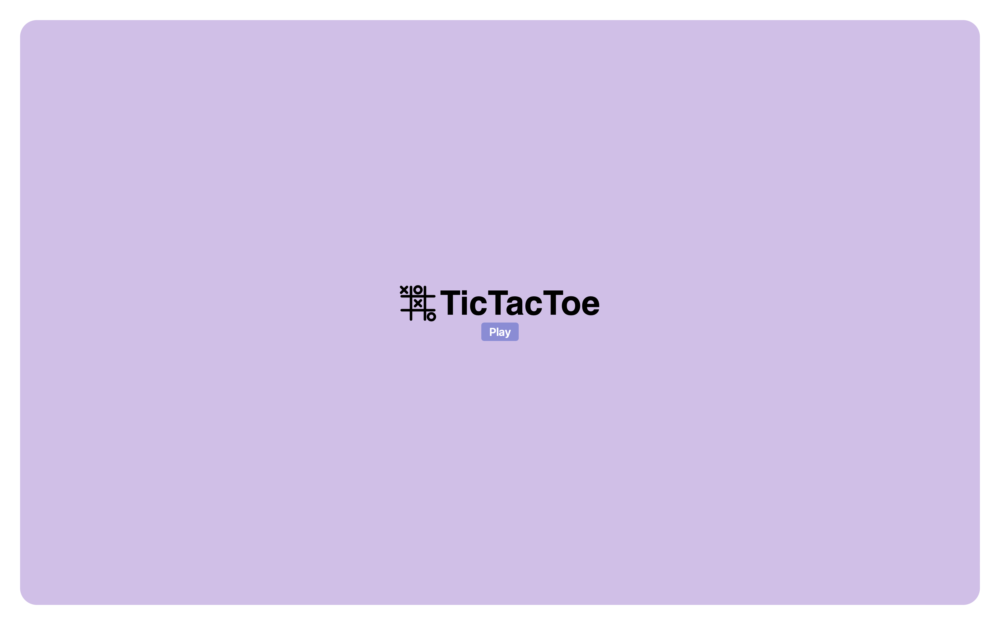
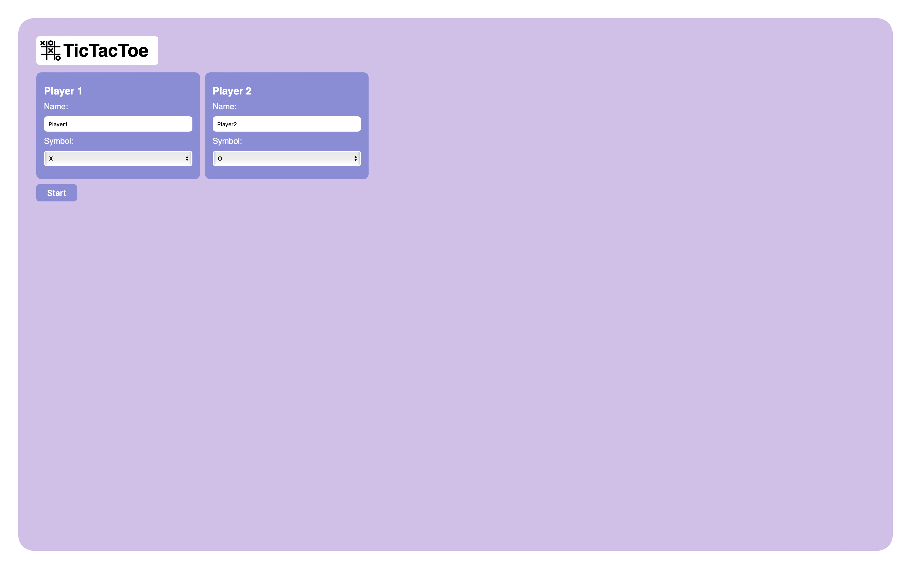
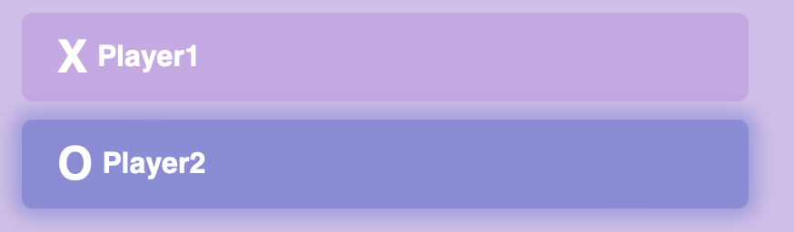
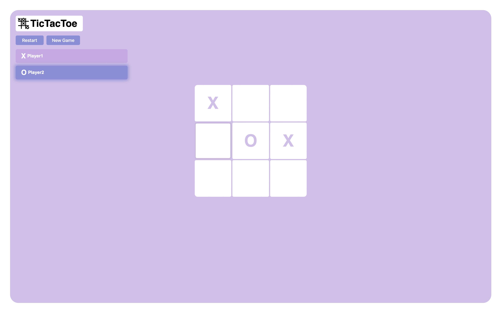

# TicTacToe

TicTacToe is a web application that allows users to play a 2-player tic-tac-toe game on one device.

## Features
- Lobby: Users can set their player names and the symbols they want to use in the game.
- New Game: Users can go back to the lobby to create a new game and re-customize their player names and symbols.
- Restart: Users can restart the entire game board without needing to go back to the lobby.
- Auto-restart: The game auto-restarts once the previous match ends.

## Getting Started
- You can access TicTacToe by visiting the following link: [TicTacToe](https://jaizzer.github.io/tic-tac-toe/).
- Alternatively, if you prefer to run TicTacToe locally, you can follow these steps:
  1. Clone the repository: `https://github.com/Jaizzer/tic-tac-toe.git`
  2. Navigate to the project directory: `cd tic-tac-toe`
  3. Open the index.html file in your web browser.

## Usage
1. Upon opening the page, you will see the opening page.
2. To proceed to the **game lobby**, press the "Play" button.

   

3. Inside the game lobby, fill out the forms including the two players' names and symbols they would like to use. Once the players are satisfied with their chosen names and symbols, press the "Start" button.

   

4. At this point, players should now be inside the **play area**. Players will see an indicator showing who is the current 'turn' holder (colored in darker purple).

   

5. For a player to make their move on their turn, they just tap or click the cell they want to put their symbol in.

    

6. The game will display the result if there is a 'Tie' or a 'Winner', and then will proceed to auto-restart the game.

7. To manually restart the game, just press 'Restart'. The board will be reset.

8. To manually create a new game, just press 'New Game', and the players will be redirected back to the lobby.

## Built With
- CSS
- HTML
- JavaScript

## Contributing
Contributions to TicTacToe are very welcome! If you find any bugs or have improvement suggestions, just open an issue on the GitHub repository. You can also fork the repository, make your changes, and then submit a pull request.

## License
This project is licensed under the [MIT License](./LICENSE).
